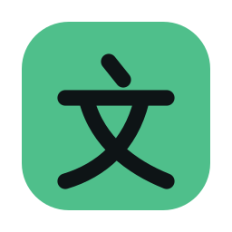

<p align="center">
  <a href="https://wenmang.ryan-mapa.dev"></a>
</p>

# 文盲 Wenmang

[Play Wenmang](https://wenmang.ryan-mapa.dev)

A Mandarin vocabulary game that turns into a handwriting trainer. Words first,
in multiple choice with Leitner-box spaced repetition; then characters drawn stroke by stroke on a 米字格 pad. Everything is the
first and default vocabulary category.

The name means *illiterate* — literally "writing-blind". It is meant as a joke
about where you start. Worth knowing that in Chinese it is a blunt word, used
seriously and sometimes as an insult, so a native speaker may read it harder
than an English-speaking learner will.

## Run it

No build step — ES modules straight from the filesystem:

```sh
npm install
npm run serve      # the game alone, on :8000
npm run dev        # the game plus the API and a local database, on :8787
npm test           # 191 tests
```

Use `serve` for anything that does not touch accounts; it is faster to start
and needs nothing configured. Use `dev` when you are working on sign-in or
sync.

## How it works

**Words.** 1,760 words across 25 decks, in rounds of 20 multiple-choice
questions. Distractors come from the same deck, so a question is a real test
rather than a reading exercise. A card climbs a box on a right answer and falls
to the bottom on a wrong one, with intervals in real time rather than question
counts.

**Direction.** 中文 → English is recognition; English → 中文 is recall, and in
Chinese the gap is wider than in a language written with an alphabet — you can
recognise 蝴蝶 on sight long before you could pick it from four plausible
character strings. A mixed round is exactly half and half, but *which* words
spend the recall slots is weighted by how well each one is known.

**Stages.** Each deck runs Basics → Everyday → Fluent, and a stage opens at 60%
mastery of the one before it. Stages are a multi-select, so Basics and Everyday
can be studied together rather than one or the other.

**Script.** One toggle cycles characters → pinyin → both. The default is
characters alone, deliberately: pinyin shown beside a character gets read
*instead of* it, and the round teaches you nothing you did not already know.

**Characters are always open.** Choose **All words** (the default) to practise
characters from the full vocabulary, or **Known words** for words whose latest
answer was correct (box 1 or higher). This choice is saved on this browser.
Characters retain an example word for context. An empty Known words selection
explains how to start rather than locking the Characters tab.

**Writing is by the word, not the character.** A round asks you to write 狐狸,
not 狐 — the pad gives one square per character in reading order, and the word
above it is the prompt. Practising half of a two-character word teaches a shape
without the word it belongs to, and leaves you guessing which half was meant.
Repeats get their own square: 妈妈 is written twice, because that is what
writing 妈妈 is.

Scheduling still runs on characters, since that is what progress is tracked
against — the scheduler picks the character most in need of work and the word
comes with it. A round is counted in characters rather than words, so the
hand-work is consistent whichever words come up.

**Writing has three modes**, and one rule that matters:

| Mode | Pad shows | Can promote a card to |
|---|---|---|
| Teach & trace | outline, animated stroke order, per-stroke guides | box 1 |
| Outline only | outline | box 3 |
| Blank pad | nothing | box 4 — mastered |

**A character cannot reach the top box from anything but a blank pad.** Tracing
a shape you can see is a different skill from producing one you cannot, and a
system that let tracing count as mastery would report fluency nobody has. The
default setting follows each card up that ladder on its own; pinning a mode is
possible any time and is not cheating, it just will not move a card past the
mode's cap.

**Hints give structure before shape.** The ladder is stroke count → the radical
and what it means → the outline → the next stroke. This is the Wubi insight
without Wubi's data: told "this is a 女 character with six strokes", most people
recover the rest themselves and have learned something reusable when they do.
Being shown the next stroke teaches only that stroke. One hint is free; past
that the attempt stops counting as a success.

**Audio.** Four Mandarin voices per word, two women and two men. Tapping the
speaker cycles rather than repeats — one tap is a reminder, four is listening
practice, and hearing the same tones in four mouths is worth more in Chinese
than in a language where the vowel does not carry meaning. No speaker appears
where hearing the word would answer the question: in the recall direction the
Chinese *is* the answer. A word with no clip has no button, because a button
that fails is worse than one that is not there.

Clips are generated a deck at a time; **Food Basics is voiced, the other 24
decks are not.** Filenames are the word's characters as codepoints — 水 becomes
`6c34.mp3` — because pinyin collides constantly (是, 事 and 试 are all `shi`)
and a colliding name silently serves one word's recording for another.

**Example sentences.** One per word, shown behind a toggle: a sentence sitting
under every prompt gets read *instead of* the word, and recall is what is being
practised. The sentence follows the same script setting as the prompt —
characters, pinyin, or both — and pinyin counts as a Chinese line for safety
purposes, since in the recall direction it gives away the sound of the answer.
Before answering you get only the prompt's own side; afterwards, everything.
**Food Basics has all 25; no other deck has any.**

**Daily goal.** Five rounds, of either kind — a day spent entirely on
handwriting is as complete as one spent entirely on meanings. Streaks forgive
three missed days, and a **streak guard** holds one deliberately for a holiday.
Nothing turns the guard on for you, so a streak that survives is one somebody
decided to protect; finishing a round releases it again by itself.

**Move progress.** Progress lives in this browser alone, so it can be exported
as a code and pasted into another browser or device. The code carries both the
words and the handwriting.

**Accounts.** Signing in with Google is optional and always will be — the app
works fully signed out on localStorage, and an account only adds progress that
follows you between devices. Only `openid profile` is requested, so no email
address is ever asked for or stored.

Answers are recorded from the very first round whether or not anybody is signed
in, which is what lets somebody who signs in later bring real history with them
instead of only a snapshot. On the server that history is the source of truth
and a card is a fold over it, so two devices merge without a conflict: the log
is a set union and the fold is deterministic.

Character history folds differently from word history, and has to. A
character's box depends on the *mode* each attempt was made in, so replaying it
means replaying the caps — otherwise a character somebody has only ever traced
would come back from the server mastered. That is why every character review
carries its mode.

## Layout

```
source/
  vocab.js          the decks — 1,760 words, 25 categories, three stages each
  game.js           word-round state: mixed direction, recall weighting, scoring
  character-data.js GENERATED radical and stroke counts (tools/build-characters.mjs)
  radicals.js       the 214 Kangxi radicals, forms and glosses
  characters.js     the character inventory, writing order, and radical data
  writing.js        the three modes, the mastery cap, character history folding
  hints.js          the hint ladder — split out so writing.js stays Worker-safe
  strokes.js        the ONLY module that knows where stroke geometry comes from
  srs.js            Leitner scheduling, for word cards and character cards alike
  quiz.js           multiple-choice construction
  rounds.js         writing rounds, built from whole words
  stages.js         stage gating within a deck
  goals.js          the daily goal and the streak
  script.js         characters / pinyin / both
  storage.js        localStorage, with word and character progress kept apart
  api.js            talking to the Worker; resolves to "no API here" on a static host
worker/
  src/index.js      routes, Google OAuth, session cookie, account deletion
  src/auth.js       HMAC-SHA256 JWT on Web Crypto
  src/sync.js       push answers, pull cards; folds each kind by its own rule
  migrations/       D1 schema
```

Every rule lives in `source/` and is tested without a browser. `main.js` is
screen wiring only.

## The vocabulary, and how it is checked

1,760 words: exactly half of [Vocabulario](https://vocabulario.ryan-mapa.dev)'s
3,520, across the same 25 categories so the two apps read as siblings. Seven
decks are deliberately smaller, for the same reasons its are — Numbers Basics
*is* 0–20, and Questions & Connectors is a closed class throughout. Padding
those to a round number would mean inventing filler.

**Tones are machine-checked.** A wrong gloss is caught by anyone who reads it; a
wrong tone is not, and it is the error that teaches somebody to say a word wrong
for years. So every entry's pinyin is checked against the readings Unicode
records for each character — one syllable per character, in order, with the tone
compared against the reading that produced the match:

```sh
curl -O https://www.unicode.org/Public/UCD/latest/ucd/Unihan.zip
unzip -d /tmp/unihan Unihan.zip
node tools/check-vocab.mjs /tmp/unihan      # tones, duplicates, deck sizes
node tools/build-characters.mjs /tmp/unihan # regenerate character-data.js
```

The checker is generous about *which* reading counts, taking the union of four
Unihan fields, because 多音字 are common and a word may use a rare reading. It
is strict about shape: syllables must line up with characters one for one, which
is what catches a dropped or spurious syllable. Neutral tone is accepted
anywhere but the first syllable — 桌子 really is zhuōzi — and 一, 不 and 儿 take
any tone, since theirs changes in context. A final 儿 may also be absorbed
entirely, because 哪儿 is nǎr and not nǎ ér.

What it cannot check, and does not pretend to, is whether a gloss is the right
English or whether the register is natural. **The vocabulary has not been
reviewed by a native speaker.**

## Deploying

The Worker serves the app *and* the API from one origin, so there is no CORS
and the session can ride in an HttpOnly cookie that page scripts — and
therefore any XSS — cannot read.

```sh
npx wrangler d1 create wenmang        # put the id in wrangler.toml
npm run db:apply                      # or db:local for the dev database
npx wrangler secret put JWT_SECRET            # random 32+ bytes
npx wrangler secret put GOOGLE_CLIENT_ID
npx wrangler secret put GOOGLE_CLIENT_SECRET
npm run deploy
```

The Google OAuth client needs `https://<your-domain>/auth/google/callback` as
an authorized redirect URI. Without `GOOGLE_CLIENT_ID` set, `/auth/google/start`
answers 503 and the app simply never shows the account controls — which is also
what happens on a plain static host with no Worker at all.

Google requires a privacy policy on the OAuth consent screen; `/privacy` and
`/terms` are served from this repository for that purpose. The App domain
fields want `https://wenmang.ryan-mapa.dev` and those two paths, while
**Authorized domains** takes the registrable domain alone — `ryan-mapa.dev`,
not the subdomain, which Google rejects there.

## Licensing

See [NOTICE](NOTICE). Short version: the code and the vocabulary are original;
stroke geometry is Arphic-licensed data fetched at runtime and never vendored,
which keeps the redistribution obligations off this repository; radical data is
from Unihan under the Unicode License. `source/strokes.js` is the only module
that touches the stroke data, so the source can be swapped in one file.

## Look

The logo is a jade seal containing 文 (writing), the first character of 文盲.
The [SVG master](assets/branding/wenmang-seal.svg) is used in the header and
browser tab. For Google Cloud branding, upload the square
[256 × 256 PNG](assets/branding/wenmang-google-cloud.png).

One screen, dark, laid out like its sibling
[Vocabulario](https://vocabulario.ryan-mapa.dev): a settings row, four stat
tiles, a stage strip, and one card that swaps between a word question, the
writing pad, and the round summary. The palette is its own — ink and celadon,
a warm near-black ground with a 青 (qīng) teal running into jade, and cinnabar
kept for misses and for danger.

## Generating audio and sentences

Both run detached, so neither is something to sit and watch. Progress goes to a
status file, one line per pass.

```sh
cp ../vocabulario/.tts.env .tts.env                       # Azure key, gitignored
nohup bash tools/audio-daemon.sh shiwu 0 > /dev/null 2>&1 &
cat /tmp/wenmang-audio.status

nohup bash tools/sentences-daemon.sh shiwu 0 > /dev/null 2>&1 &
cat /tmp/wenmang-sentences.status
```

Audio costs no model usage — it is Azure and a shell loop. Sentences call the
Anthropic API with a key in `.gen.env`, which costs money but not session time.
Both skip work already done, so they are safe to interrupt and safe to re-run.

For sentences there is a cheaper path worth knowing about: Vocabulario never
used an API at all. `brief.mjs` hands a deck to an agent, `check-batch.mjs`
validates the reply offline, `merge-batch.mjs` merges it — session usage instead
of money, with the validation loop already worked out. Porting that is probably
the right move before doing the remaining 24 decks.

## Not done yet

- **A native-speaker review of the vocabulary and the sentences.** Tones are
  verified against Unihan, for words and for sentences alike, but register and
  naturalness are not machine-checkable and have not been read by anyone who
  would notice.
- **Audio and sentences beyond Food Basics.** 25 words of 1,760 are voiced, and
  25 have example sentences. Both are a matter of running the generators.
- **Audio for a real deploy.** `audio/` is gitignored, so a deploy uploads
  whatever is on the deploying machine. Fine for 100 files; Vocabulario moved to
  R2 before it was thousands, and so should this.
- **First load takes about two seconds.** Eighteen unbundled ES modules
  waterfalling. No build step was the right call locally and costs real latency
  over the network; Vocabulario has a `build.mjs` for exactly this.
- **A third-party request on every character.** Stroke data is fetched from
  jsDelivr as you practise, which is disclosed in the privacy policy. Avoiding
  it means self-hosting the data and taking on the Arphic notice obligations —
  a deliberate trade either way, not an oversight.
